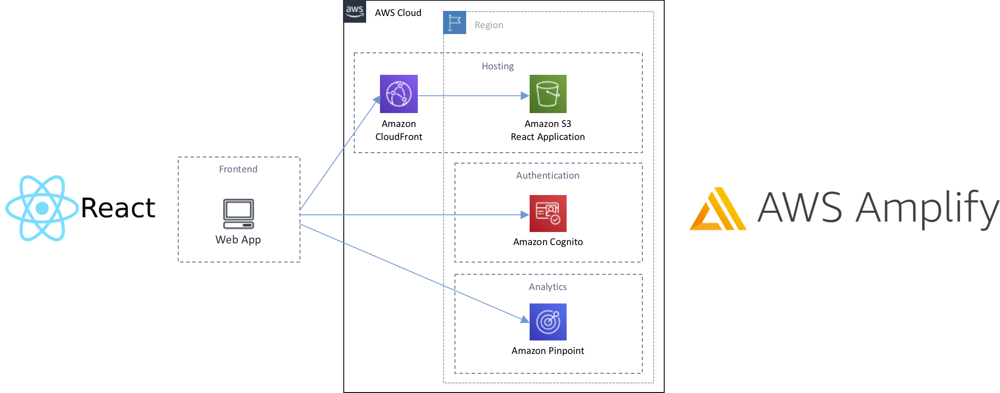

# Create a React application from scratch and deploy with Amplify CLI



## Prerequisites

Work in your local or [AWS Cloud9](https://aws.amazon.com/cloud9/) environment with the following:

1. [AWS CLI configured with IAM Credentials](https://docs.aws.amazon.com/cli/latest/reference/configure/)
2. [Amplify CLI](https://docs.amplify.aws/cli/start/install)

## Install dependencies and create the React application

Install Amplify CLI tool https://docs.amplify.aws/cli/start/install

``` bash
npm install -g @aws-amplify/cli
```

Create the React project.

``` bash
npx create-react-app myapp
cd myapp
npm install --save aws-amplify aws-amplify-react @aws-amplify/ui-react @material-ui/core
```

## Initialize your project with Amplify CLI

Initialize the Amplify project with the following configurations.

``` bash
amplify init
```

* Enter a name for the project **myapp**
* Enter a name for the environment **dev**
* Choose your default editor: **Visual Studio Code** (Your preferred editor)
* Choose the type of app that you're building **javascript**
Please tell us about your project
* What javascript framework are you using **react**
* Source Directory Path: **src**
* Distribution Directory Path: **build**
* Build Command: **npm run-script build**
* Start Command: **npm run-script start**
Using default provider awscloudformation
* Do you want to use an AWS profile? **Yes**
* Please choose the profile you want to use **default** (Your profile crdentials)

## Add Analytics with Amazon Pinpoint

Add analytics using Amazon Pinpoint to provide insight into how your application is performing.

``` bash
amplify add analytics
```

* Select an Analytics provider **Amazon Pinpoint**
* Provide your pinpoint resource name: **myapp**
Adding analytics would add the Auth category to the project if not already added.
* Apps need authorization to send analytics events. Do you want to allow guests and unauthenticated users to send analytics events? (we recommend you allow this when getting started) **Yes**

Push to create/update the cloud resources.

``` bash
amplify push
```

* Are you sure you want to continue? **Yes**

After resources are created you will receive the URL for Amazon Pinpoint console to track your app events. Now you can [configure your app and record events](https://docs.amplify.aws/lib/analytics/getting-started/q/platform/js#configure-your-app).

## Add Authentication with Amazon Cognito

By adding Analytics, the authentication module was added. Update with the following command using the default values.

``` bash
amplify auth update
```

* What do you want to do? **Apply default configuration without Social Provider (Federation)**

Push to create these changes in the cloud.

``` bash
amplify push
```

* Are you sure you want to continue? **Yes**

## Use Authentication and send custom events to Amazon Pinpoint

We are going to [use pre-built UI component for Authentication](https://docs.amplify.aws/lib/auth/getting-started/q/platform/js#option-1-use-pre-built-ui-components) and [record custom events to Amazon Pinpoint](https://docs.amplify.aws/lib/analytics/record/q/platform/js#recording-custom-events).

Replace your **src/App.js** with the following file [src/App.js](src/App.js) and **src/index.js** with the following file [src/index.js](src/index.js).

## Add Hosting with Amazon S3 and Amazon CloudFront

``` bash
amplify add hosting
```

* Select the plugin module to execute **Amazon CloudFront and S3**
* Select the environment setup: **PROD (S3 with CloudFront using HTTPS)**
* hosting bucket name **myapp-20201213012838-hostingbucket** (Use the default value)

You can now publish your app.

``` bash
amplify publish
```

* Are you sure you want to continue? **Yes**

Use the **Hosting endpoint** to browse inside your React application.